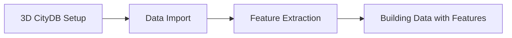

[](https://github.com/THD-Spatial/City2TABULA/actions/workflows/go.yml)
&nbsp;
[](https://city2tabula.readthedocs.io/en/latest/)
&nbsp;
[](https://github.com/THD-Spatial/City2TABULA/releases)

# City2TABULA

A high-performance Go-based tool for preparing 3D spatial data from CityDB and PostGIS-enabled PostgreSQL databases. The tool is part of a larger pipeline to classify OSM buildings into TABULA building types for heating demand estimation.

The pipeline processes spatial features such as attached neighbours, grid-based geometry relationships, and building characteristics from LOD2 and LOD3 3D building data. The extracted data is then used to train Random Forest (RF) models for automated building classification.

## Key Features

### **Core Processing Capabilities**
- **Building-Centric Parallel Processing**: Advanced parallel architecture processing 100K+ buildings efficiently
- **CityDB Integration**: Native support for 3D building data (LOD2/LOD3) in CityGML and CityJSON format from CityDB schemas
- **Parameterized SQL Templates**: Dynamic SQL scripts supporting multiple LOD levels with single templates
- **Batch Processing**: Optimized batch processing with configurable batch sizes for large datasets

### **Data Processing Pipeline**
- **Multi-LOD Support**: Process both LOD2 and LOD3 building data simultaneously
- **Spatial Analysis**: Building geometry analysis, volume calculations, and neighbour detection
- **Feature Extraction**: Child feature extraction (walls, roofs, windows) with geometric relationships
- **TABULA Integration**: Building type classification using TABULA methodology

### **Performance & Scalability**
- **Memory Efficient**: Batch-based processing preventing memory exhaustion
- **Parallel Architecture**: Goroutine-based workers achieving 2.5-4x performance improvements
- **Database Optimization**: Query plan caching and connection pooling

## System Requirements

### Software Dependencies

**Required:**
- **Go**: 1.21 or later (Download from [golang.org](https://go.dev/doc/install))

- **PostgreSQL**: 17+ with PostGIS 3.5+ (https://www.postgresql.org/download/)

- **PostGIS**: 3.5+ (https://postgis.net/install/)

- **Java**: 17+ for CityDB Tool (https://www.oracle.com/java/technologies/downloads/)

- **Git**: 2.25+ for source management (https://git-scm.com/downloads)

### CityDB Tool

- **CityDB Importer/Exporter**: v1.0.0 Download from [here](https://github.com/3dcitydb/citydb-tool/releases/tag/v1.0.0)

Unzip the downloaded file and place the `citydb-tool` directory in a known location (e.g., `/opt/citydb-tool` or `C:\Program Files\citydb-tool`).

## 🐳 Quick Start with Docker (Recommended)

The fastest way to get started with City2TABULA is using Docker. This approach automatically handles all dependencies and setup.

### Prerequisites
- [Docker](https://docs.docker.com/get-docker/) 20.10+
- [Docker Compose](https://docs.docker.com/compose/install/) 2.0+

### 30-Second Setup

```bash
# Clone the repository
git clone https://github.com/THD-Spatial/City2TABULA.git
cd City2TABULA

# Quick start with Docker (automatically configures environment)
make setup
```

When you run `make setup`, it will:
1. **Build** the Docker environment
2. **Copy** `environment/docker.env` to `.env`
3. **Prompt** for your PostgreSQL password (input hidden)
4. **Start** the containers automatically

### What the Docker setup includes:
- **Go 1.23.3** runtime (automatically configured)
- **Java 25** with CityDB Tool 1.1.0 (automatically downloaded)
- **All system dependencies** (PostGIS tools, GDAL, etc.)
- **Sample data** and **configuration**
- **Development environment** ready to use

### Why Docker? 🤔

| Feature | Docker | Manual Install |
|---------|--------|----------------|
| **Setup Time** | ~30 seconds | 15-30 minutes |
| **Configuration** | Automated prompting | Manual .env editing |
| **Dependencies** | Auto-managed | Manual setup required |
| **Environment Isolation** | | - |
| **Cross-platform** | | OS-dependent |
| **Version Consistency** | | Varies |
| **Sample Data** | Included | Separate download |
| **Password Security** | Hidden input | Manual editing |

---

### Docker Commands

| Command | Description |
|---------|-------------|
| `make setup` | **Complete setup**: Build environment, copy config, prompt for password, start containers |
| `make configure` | Copy docker.env to .env and prompt for PostgreSQL password only |
| `make dev` | Start development environment with interactive shell |
| `make create-db` | Create database and import data |
| `make extract-features` | Run feature extraction pipeline |
| `make quick-start` | **Full pipeline**: setup + create-db + extract-features |
| `make status` | Check container status |
| `make logs` | View container logs |
| `make clean` | Stop and remove containers |

### Complete Docker Workflow

```bash
# 1. Automated setup (builds, configures, starts)
make setup
# You'll be prompted: "Please enter your PostgreSQL password:"
# (Input is hidden for security)

# 2. Access development shell
make dev

# Inside the container:
./city2tabula -create_db           # Setup database
./city2tabula -extract_features    # Extract features
./city2tabula -help               # Show all options
```

**Alternative: One-command full pipeline**
```bash
make quick-start  # Does everything: setup + create-db + extract-features
```

### Docker Configuration

The Docker environment automatically manages configuration:

**Automatic Setup:**
- When you run `make setup`, it automatically copies `environment/docker.env` to `.env`
- Prompts you for your PostgreSQL password (input hidden for security)
- Updates the `.env` file with your password

**Manual Configuration (Optional):**
If you need to customize settings, edit the generated `.env` file:

```bash
# Database settings (connects to host PostgreSQL)
DB_HOST=172.17.0.1
DB_PORT=5432
DB_USER=postgres
DB_PASSWORD=your_actual_password  # Automatically set during setup

# Country for processing
COUNTRY=germany

# CityDB tool (automatically configured)
CITYDB_TOOL_PATH=/usr/local/citydb-tool/citydb-tool-1.1.0/bin/citydb
CITYDB_SRID=25832
```

**Environment File Management:**
- `.env` file is created automatically during `make setup`
- If `.env` already exists, setup skips the configuration step
- To reconfigure: delete `.env` and run `make configure` or `make setup`

### Data Management with Docker

Place your 3D data files in the `data` directory before starting:

```
data/
├── lod2/germany/your-city.gml
├── lod3/germany/your-city.gml
└── tabula/germany.csv (included)
```

The data directory is automatically mounted into the container.

### Advantages of Docker Setup
 **Zero Manual Configuration** - Automatic .env setup with password prompting **Consistent Environment** - Same setup across all operating systems **Secure Password Handling** - Hidden password input during setup **Easy Cleanup** - Remove everything with `make clean` **Development Ready** - Built-in development environment **Auto-dependency Management** - All tools automatically downloaded **One-Command Pipeline** - Full setup and processing with `make quick-start`

---

## 🔧 Manual Installation (Alternative)

If you prefer to install dependencies manually or need a custom setup:


## Pipeline Overview

The City2TABULA pipeline consists of several stages:




## Project Structure

> This tool is under active development. Therefore it may be subject to changes and improvements over time.

```
City2TABULA/
├── cmd
│   └── main.go
├── data
│   ├── example_data # Example datasets for testing and demonstration
│   │   ├── example_lod2
│   │   │   ├── austria
│   │   │   │   └── 109082
│   │   │   │       └── 109082.gml
│   │   │   ├── germany
│   │   │   │   ├── 788_5416.gml
│   │   │   │   └── 790_5416.gml
│   │   │   └── netherlands
│   │   │       ├── 7-736-608.city.json
│   │   │       └── 8-736-600.city.json
│   │   └── example_lod3
│   │       └── germany
│   │           ├── 6432
│   │           │   ├── 6432.gml
│   │           │   └── images
│   │           └── 6433
│   │               ├── 6433.gml
│   │               └── images
│   ├── lod2
│   │   ├── austria
│   │   ├── czech
│   │   ├── germany
│   │   └── netherlands
│   ├── lod3
│   │   ├── austria
│   │   ├── czech
│   │   ├── germany
│   │   └── netherlands
│   ├── README.md
│   └── tabula # TABULA datasets for 20 European countries
│       ├── austria.csv
│       ├── belgium.csv
│       ├── bulgaria.csv
│       ├── ...
│       └── united_kingdom.csv
├── docs # ReadTheDocs documentation source files
├── go.mod
├── go.sum
├── internal
│   ├── config
│   │   ├── batch.go
│   │   ├── citydb.go
│   │   ├── config.go
│   │   ├── database.go
│   │   ├── data.go
│   │   ├── env.go
│   │   └── sql.go
│   ├── db
│   │   ├── connection.go
│   │   └── setup.go
│   ├── importer
│   │   ├── citydb.go
│   │   └── supplementary.go
│   ├── process
│   │   ├── job.go
│   │   ├── orchestrator.go
│   │   ├── pipeline.go
│   │   ├── queue.go
│   │   ├── runner.go
│   │   └── worker.go
│   ├── tests
│   │   ├── batch_test.go
│   │   ├── config_test.go
│   │   ├── connection_test.go
│   │   ├── job_test.go
│   │   ├── logger_test.go
│   │   └── pipeline_test.go
│   └── utils
│       ├── batch.go
│       ├── citydb.go
│       ├── exec.go
│       ├── logger.go
│       └── print.go
├── LICENSE
├── logs
│   ├── 2025-10-10.log
│   └── 2025-10-13.log
├── README.md
├── scripts
└── sql
    ├── functions
    │   └── 01_surface_area_corrected_geom.sql
    ├── schema
    │   ├── 01_create_tabula_tables.sql
    │   └── 02_create_main_tables.sql
    └── scripts
        ├── main
        │   ├── 01_get_child_feat.sql
        │   ├── 02_dump_child_feat_geom.sql
        │   ├── 03_calc_child_feat_attr.sql
        │   ├── 04_calc_bld_feat.sql
        │   ├── 05_calc_volume.sql
        │   ├── 06_calc_storeys.sql
        │   └── 07_label_building_features.sql
        └── supplementary
            └── 01_extract_tabula_attributes.sql
```

---
## Example Usage

The following examples guide users through downloading, configuring, and running City2TABULA. **Docker setup is recommended** for the easiest experience.

### 🐳 Docker Method (Recommended)

```bash
# Clone and setup
git clone https://github.com/THD-Spatial/City2TABULA.git
cd City2TABULA

# Place your data in data/lod2/[country]/ and data/lod3/[country]/

# Complete automated setup
make setup              # Builds environment, configures .env, prompts for password
make dev                # Access development shell
./city2tabula -create_db        # Setup database
./city2tabula -extract_features # Extract features

# Or use one-command pipeline:
make quick-start        # Does everything: setup + create-db + extract-features
```

### Binary Download Method

For users who prefer downloading pre-built binaries:

### 1. Download executable and source code

> **Note:** Make sure to download the binary that matches your operating system and architecture (e.g., Linux AMD64, MacOS ARM64, Windows AMD64).

All the release tags are available at the [Releases](https://github.com/THD-Spatial/City2TABULA/releases) page.

**Download source code:**
```bash
# Download the latest release (e.g., v0.3.0-alpha)
wget https://github.com/THD-Spatial/City2TABULA/archive/refs/tags/v0.3.0-alpha.zip

# Unzip and rename the directory for convenience
unzip v0.3.0-alpha.zip
mv City2TABULA-0.3.0-alpha City2TABULA
cd City2TABULA
```

**Download the appropriate binary for your system:**

| OS | Command |
|---|---|
| **Linux AMD64** | `wget https://github.com/THD-Spatial/City2TABULA/releases/download/v0.3.0-alpha/city2tabula-linux-amd64` |
| **MacOS ARM64** | `wget https://github.com/THD-Spatial/City2TABULA/releases/download/v0.3.0-alpha/city2tabula-macos-arm64` |
| **MacOS AMD64** | `wget https://github.com/THD-Spatial/City2TABULA/releases/download/v0.3.0-alpha/city2tabula-macos-amd64` |
| **Windows AMD64** | `Invoke-WebRequest -Uri "https://github.com/THD-Spatial/City2TABULA/releases/download/v0.3.0-alpha/city2tabula-windows-amd64.exe" -OutFile "city2tabula.exe"` |

**Make executable and verify (Unix-like systems):**
```bash
# Rename the downloaded binary
mv city2tabula-* city2tabula  # Replace * with your platform
chmod +x city2tabula

# Verify the binary works
./city2tabula -help
```

**For Windows:**
```powershell
# Verify the binary works
.\city2tabula.exe -help
```

### 2. Prepare Data
Refer to the [data/README.md](data/README.md) for sample datasets and instructions on organizing your data.

### 3. Create Configuration File
```bash
# Copy example configuration
cp .env.example .env

# Edit configuration
nano .env
```
Update the `.env` file with your database credentials, CityDB tool path, and other settings as shown in [here](#configuration).

### 4. Run the Pipeline
```bash
# Create the database and import data
./city2tabula -create_db
```

### 5. Extract Features
```bash
./city2tabula -extract_features
```


## Setup Development Environment

### 1. Clone the Repository

```bash
git clone https://github.com/THD-Spatial/City2TABULA.git
cd City2TABULA
```

### 3. Checkout the feature branch (if applicable)

```bash
git checkout <feature-branch-name>
```

**Warning:** Do not use the main branch for development.

*If you are new to git, please refer to https://github.com/firstcontributions/first-contributions*

### 2. Configuration

**Create Environment File:**
```bash
# Copy example configuration
cp .env.example .env

# Edit configuration
nano .env
```

**Example `.env` Configuration:**
```bash
# Global Configuration
COUNTRY=germany # Specify the country you want to train from the list of available countries
# Available countries: austria, belgium, cyprus, czechia, denmark, france, germany,
# greece, hungary, ireland, italy, netherlands, norway, poland, serbia, slovenia,
# spain, sweden, united_kingdom

# Database Configuration
DB_HOST=localhost
DB_PORT=5432
DB_USER=postgres
DB_PASSWORD=<your_pg_password_here>
DB_SSL_MODE=disable # enable it for production

# CityDB Configuration
CITYDB_TOOL_PATH=path/to/citydb-tool-1.X.X # Replace with actual path to CityDB tool
CITYDB_SRID=25832 # Coordinate Reference System for CityDB (UTM zone 32N for Germany)
CITYDB_SRS_NAME=ETRS89 / UTM zone 32N # Spatial Reference System Name for CityDB

# Parallel Processing Configuration
THREAD_COUNT=4        # Number of threads for parallel processing (optional)
DB_MAX_OPEN_CONNS=10   # Maximum number of open connections to the database
DB_MAX_IDLE_CONNS=5    # Maximum number of idle connections to the database

# Logging Configuration
LOG_LEVEL=INFO # Set the logging level (DEBUG, INFO, WARN, ERROR)
               # For development: DEBUG - shows all debug information
               # For production: INFO - shows essential information only
               # For monitoring: WARN - shows only warnings and errors
```

> **Note**: The available countries are based on TABULA and EPISCOPE project data. Each country has specific SRID configurations. Refer to `.env.example` for complete SRID mappings for all supported countries.


### 3. Initialise the Go Module (if not already)

```bash
go mod tidy
```

### 4. Build the Binary

```bash
go build -o city2tabula ./cmd
```

### 5. Verify Installation
```bash
# Test city2tabula (works for both downloaded binary and locally built)
./city2tabula -help
```

### 6. Prepare Data

- Download or obtain 3D city model data in CityGML or CityJSON format.
- Ensure data is organized in the following directory structure:

**Data Directory Structure:**
```
data/
├── lod2/
│   └── germany/
│       └── your-lod2-city.gml or your-lod2-city.json
├── lod3/
│   └── germany/
│       └── your-lod3-city.gml or your-lod3-city.json
└── tabula/
    └── germany.csv # Already included

# Note: You can add data for other countries by creating respective folders under lod2/ and lod3/ directories. Make sure to update the COUNTRY variable in the .env file accordingly.
```

### 7. Initialize Database
```bash
# Create complete database setup:
# - CityDB schemas (lod2, lod3)
# - Training and tabula schemas
# - Import supplementary data
./city2tabula -create_db
```


### 8. Extract Features
```bash
# Run feature extraction pipeline
./city2tabula -extract_features
```

---

### Available Commands

| Command | Description |
|---------|-------------|
| `-help` | Show help information |
| `-create_db` | Create the city2tabula database and CityDB schemas required to store the 3D city models and import the data |
| `-reset_db` | Reset the city2tabula database and CityDB schemas (drops all tables and re-creates them) |
| `-extract_features` | Run feature extraction pipeline |
| `-reset_city2tabula` | Reset only the city2tabula database (drops all tables and re-creates them). This option is useful when you want to make changes to SQL scripts for extracting features without affecting the entire database |

*For usage examples, refer to Database Commands documentation [here](/docs/source/DATABASE_COMMANDS.md).*

> **Tip:** If you are using vs code, you can use the provided [tasks.json](.vscode/tasks.json) to run the commands directly from the editor. Press Ctrl+Shift+P and type "Run Task" to see available tasks for running the commands listed in [Available Commands](#available-commands).

---

## Documentation

Comprehensive documentation is available at [City2TABULA ReadTheDocs](https://city2tabula.readthedocs.io/en/latest/)

- **Module Documentation** - Detailed API and architecture documentation
- **Configuration Reference** - All configuration options and tuning
- **Troubleshooting Guide** - Common issues and solutions

**Build Documentation Locally:**

```bash
pip install -r docs/requirements.txt
cd docs
sphinx-autobuild source build/html
```

## License

This project is licensed under the Apache License Version 2.0 - see the [LICENSE](/LICENSE) file for details.

> **Note**: This tool is under active development. Features and performance may evolve with future releases.

## Acknowledgments

This project is being developed in the context of the research project RENvolveIT (https://projekte.ffg.at/projekt/5127011).

This research was funded by CETPartnership, the Clean Energy Transition Partnership under the 2023 joint call for research proposals, co-funded by the European Commission (GA N°101069750) and with the funding organizations detailed on https://cetpartnership.eu/funding-agencies-and-call-mod-ules.​

   

- **3DCityDB**: For providing the foundation for 3D spatial data management. (https://www.3dcitydb.org/)
