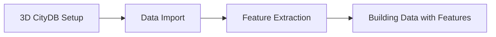

# City2TABULA

A high-performance Go-based tool for preparing 3D spatial data from CityDB and PostGIS-enabled PostgreSQL databases. The tool is part of a larger pipeline to classify OSM buildings into TABULA building types for heating demand estimation.

The pipeline processes spatial features such as attached neighbours, grid-based geometry relationships, and building characteristics from LOD2 and LOD3 3D building data. The extracted data is then used to train Random Forest (RF) models for automated building classification.

## Key Features

### **Core Processing Capabilities**
- **Building-Centric Parallel Processing**: Advanced parallel architecture processing 100K+ buildings efficiently
- **CityDB Integration**: Native support for 3D building data (LOD2/LOD3) from CityDB schemas
- **Parameterized SQL Templates**: Dynamic SQL scripts supporting multiple LOD levels with single templates
- **Batch Processing**: Optimized batch processing with configurable batch sizes for large datasets

### **Data Processing Pipeline**
- **Multi-LOD Support**: Process both LOD2 and LOD3 building data simultaneously
- **Spatial Analysis**: Building geometry analysis, volume calculations, and neighbour detection
- **Feature Extraction**: Child feature extraction (walls, roofs, windows) with geometric relationships
- **TABULA Integration**: Building type classification using TABULA methodology

### **Performance & Scalability**
- **High Throughput**: 64,400+ buildings per second processing capability
- **Memory Efficient**: Batch-based processing preventing memory exhaustion
- **Parallel Architecture**: Goroutine-based workers achieving 2.5-4x performance improvements
- **Database Optimization**: Query plan caching and connection pooling

## System Requirements

### Software Dependencies

**Required:**
- **Go**: 1.21 or later (Download from [golang.org](https://go.dev/doc/install))

- **PostgreSQL**: 17+ with PostGIS 3.5+ (https://www.postgresql.org/download/)

- **PostGIS**: 3.5+ (https://postgis.net/install/)

- **Java**: 17+ for CityDB Tool

- **Git**: 2.25+ for source management

### CityDB Tool
- **CityDB Importer/Exporter**: v1.0.0 Download from [here](https://github.com/3dcitydb/citydb-tool/releases/tag/v1.0.0)

Unzip the downloaded file and place the `citydb-tool` directory in a known location (e.g., `/opt/citydb-tool` or `C:\Program Files\citydb-tool`).

### Configuration

**Create Environment File:**
```bash
# Copy example configuration
cp .env.example .env

# Edit configuration
nano .env
```

**Example `.env` Configuration:**
```bash
# Database Configuration
DB_HOST=localhost
DB_PORT=5432
DB_USER=your_username
DB_PASSWORD=your_password
DB_SSL_MODE=disable

# Country/Region (affects database name: City2TABULA_{country})
COUNTRY=germany

# CityDB Tool Path
CITYDB_TOOL_PATH=/opt/citydb-tool

# Processing Configuration
BATCH_SIZE=1000        # Buildings per batch
BATCH_THREADS=8        # Parallel worker threads

# Logging
LOG_LEVEL=INFO
```

## Quick Start

### 1. Verify Installation
```bash
# Test City2TABULA
./City2TABULA --help

### 2. Prepare Data

- Download or obtain 3D city model data in CityGML or CityJSON format.
- Ensure data is organized in the following directory structure:

**Data Directory Structure:**
```
data/
├── lod2/
│   └── germany/
│       └── your-lod2-city.gml or your-lod2-city.json
├── lod3/
│   └── germany/
│       └── your-lod3-city.gml or your-lod3-city.json
└── tabula/
    └── germany.csv # Already included
```

### 3. Initialize Database
```bash
# Create complete database setup:
# - CityDB schemas (lod2, lod3)
# - Training and tabula schemas
# - Import supplementary data
./City2TABULA --create_db
```


### 4. Extract Features
```bash
# Run feature extraction pipeline
./City2TABULA --extract_features
```

## Pipeline Overview

The City2TABULA pipeline consists of several stages:



### Available Commands

| Command | Description |
|---------|-------------|
| `--help` | Show help information |
| `--create_db` | Create the City2TABULA database and CityDB schemas required to store the 3D city models and import the data |
| `--reset_db` | Reset the City2TABULA database and CityDB schemas (drops all tables and re-creates them) |
| `--extract_features` | Run feature extraction pipeline |
| `--reset_City2TABULA` | Reset only the City2TABULA database (drops all tables and re-creates them). This option is useful when you want to make changes to SQL scripts for extracting features without affecting the entire database |

---

## Project Structure

> This tool is under active development. Therefore it may be subject to changes and improvements over time.

```
├── City2TABULA
├── cmd
│   ├── main.go
│   └── test_file_grouping.go
├── data
│   ├── lod2
│   │   ├── austria
│   │   │   ├── 105082_fixed.gml
│   │   │   └── vienna
│   │   ├── czech
│   │   ├── germany
│   │   │   ├── deggendorf
│   │   │   │   ├── 784_5412.gml
│   │   │   │   └── 786_5412.gml
│   │   │   └── lks_deggendorf
│   │   │       └── lks_deggendorf.meta4
│   │   └── netherlands
│   │       ├── 7-736-608.city.json
│   │       └── 8-736-600.city.json
│   ├── lod3
│   │   ├── austria
│   │   ├── czech
│   │   ├── germany
│   │   └── netherlands
│   ├── README.md
│   └── tabula
│       ├── austria.csv
│       ├── belgium.csv
│       ├── bulgaria.csv
│       ├── ...
│       ├── sweden.csv
│       └── united_kingdom.csv
├── docs
├── examples
├── format.
├── go.mod
├── go.sum
├── internal
│   ├── config
│   │   ├── batch.go
│   │   ├── citydb.go
│   │   ├── config.go
│   │   ├── database.go
│   │   ├── data.go
│   │   ├── env.go
│   │   └── sql.go
│   ├── db
│   │   ├── connection.go
│   │   └── setup.go
│   ├── importer
│   │   ├── citydb.go
│   │   └── supplementary.go
│   ├── process
│   │   ├── job.go
│   │   ├── orchestrator.go
│   │   ├── pipeline.go
│   │   ├── queue.go
│   │   ├── runner.go
│   │   └── worker.go
│   └── utils
│       ├── batch.go
│       ├── citydb.go
│       ├── exec.go
│       ├── logger.go
│       └── print.go
├── logs
│   ├── YYYY-MM-DD.log
├── README.md
└── sql
    ├── functions
    │   └── 01_surface_area_corrected_geom.sql
    ├── schema
    │   ├── 01_create_tabula_tables.sql
    │   └── 02_create_main_tables.sql
    └── scripts
        ├── main
        │   ├── 01_get_child_feat.sql
        │   ├── 02_dump_child_feat_geom.sql
        │   ├── 03_calc_child_feat_attr.sql
        │   ├── 04_calc_bld_feat.sql
        │   ├── 06_calc_volume.sql
        │   ├── 07_calc_storeys.sql
        │   ├── 08_calc_attached_neighbours.sql
        │   └── 09_label_building_features.sql
        └── supplementary
            └── 01_extract_tabula_attributes.sql
```

---

## Installation

### 1. Clone the Repository

```bash
git clone https://mygit.th-deg.de/thd-spatial-ai/data_pipelines/city2tabula.git
cd City2TABULA
```

### 2. Initialise the Go Module (if not already)

```bash
go mod tidy
```

### 3. Build the Binary

```bash
go build -o City2TABULA ./cmd
```

### 4. Run

```bash
./City2TABULA
```

---

## Documentation

Comprehensive documentation is available in the `docs/` directory:

- **Installation Guide** - Complete setup instructions with all dependencies
- **Quick Start Guide** - Get running quickly with sample data
- **Module Documentation** - Detailed API and architecture documentation
- **Configuration Reference** - All configuration options and tuning
- **Troubleshooting Guide** - Common issues and solutions
- **Performance Optimization** - Scaling and tuning recommendations

**Build Documentation Locally:**

```bash
pip install -r docs/requirements.txt
cd docs
sphinx-autobuild source build/html
```

## License

This project is licensed under the MIT License - see the [LICENSE](/LICENSE) file for details.

## Support

- **Documentation**: Comprehensive guides in `docs/` directory

## Acknowledgments

- **3D CityDB**: For providing the foundation for 3D spatial data management

---

> **Note**: This tool is under active development. Features and performance may evolve with future releases.