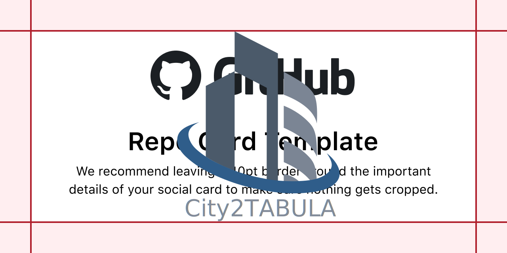

[](https://github.com/thd-spatial-ai/city2tabula/actions/workflows/go.yml)
&nbsp;
[](https://codecov.io/gh/thd-spatial-ai/city2tabula)
&nbsp;
[](https://thd-spatial-ai.github.io/city2tabula)
&nbsp;
[](https://github.com/thd-spatial-ai/city2tabula/releases)

City2TABULA is a high-performance, Go-based data preparation tool for 3D building datasets stored in PostgreSQL/PostGIS using CityDB schemas. Its primary purpose is to extract, normalise, and enrich geometric and spatial attributes from LoD2 and LoD3 building models, enabling downstream tasks such as building typology classification and heating demand estimation.

The tool is designed as an upstream component within a larger research and modelling pipeline, where prepared building-level features are later consumed by machine learning models or energy calculation services, for example TABULA-based workflows.

City2TABULA focuses on scalable, database-centric processing of large national- or city-scale datasets, avoiding country-specific assumptions and minimising manual intervention.

---

## Quick Start

**Prerequisite:** [Docker](https://docs.docker.com/get-docker/)

```bash
make setup          # Build image, start containers (PostGIS + CityDB CLI included)
make create-db      # Create database and import data
make extract-features
```

Full setup instructions for all platforms (Linux, macOS, Windows) are in the [installation guide](https://thd-spatial-ai.github.io/city2tabula/installation/setup/).

---

## Local Documentation (MkDocs)

```bash
python -m pip install -r docs/requirements.txt
python -m mkdocs serve
```

---

## CLI

### Flags

| Flag | Description |
|------|-------------|
| `-create-db` | Create the complete City2TABULA database (CityDB infrastructure + schemas + data import) |
| `-reset-db` | Reset everything: drop all schemas and recreate the complete database |
| `-reset-citydb` | Reset only CityDB infrastructure (drop CityDB schemas, recreate, and re-import data) |
| `-reset-city2tabula` | Reset only City2TABULA schemas (preserves CityDB) |
| `-extract-features` | Run the feature extraction pipeline |
| `-version` / `-v` | Print version and exit |

---

## Testing

```bash
# Unit tests
go test ./...

# Unit tests with coverage
go test -coverprofile=coverage.out -covermode=atomic ./...
go tool cover -html=coverage.out

# Integration tests (requires Docker)
go test -tags integration -v -timeout 10m ./internal/process/

# SQL benchmarks (requires Docker)
go test -tags integration -bench=. -benchmem -run=^$ ./internal/process/
```

---

## License

This project is licensed under the Apache License Version 2.0 - see the [LICENSE](/LICENSE) file for details.

> [!NOTE]
> This tool is under active development. Features and performance may evolve with future releases.

## Acknowledgments

This project is being developed in the context of the research project RENvolveIT (<https://projekte.ffg.at/projekt/5127011>).
This research was funded by CETPartnership, the Clean Energy Transition Partnership under the 2023 joint call for research proposals, co-funded by the European Commission (GA N°101069750) and with the funding organizations detailed on <https://cetpartnership.eu/funding-agencies-and-call-modules>.​

  

**3DCityDB:** For providing the foundation for 3D spatial data management. (accessed 13.11.2025, [https://www.3dcitydb.org/](https://www.3dcitydb.org/))

**TABULA & EPISCOPE (IEE Projects):** building-characteristic data (accessed 13.11.2025, [https://episcope.eu/iee-project/tabula/](https://episcope.eu/iee-project/tabula/))
