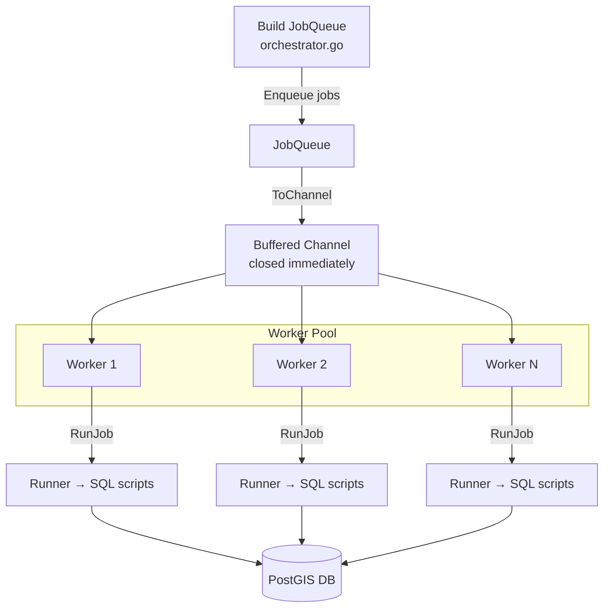
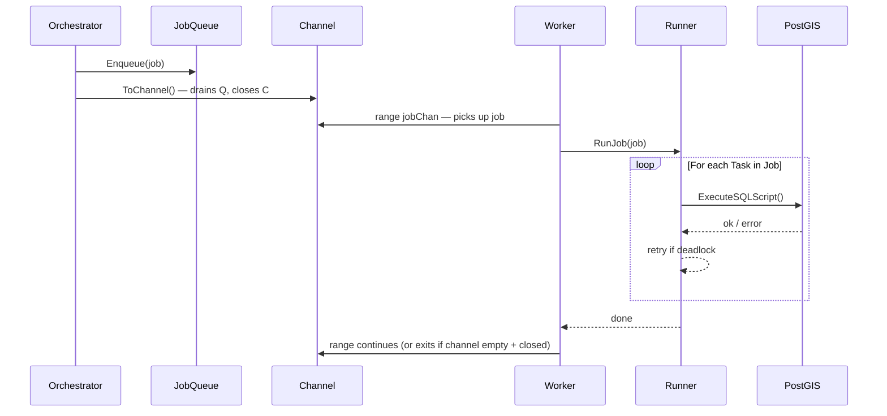

# Job Queue & Worker Pipeline

This page explains how City2TABULA hands off work from a queue to a pool of parallel workers. If you're new to Go channels, start here.

---

## The problem it solves

Feature extraction runs the same set of SQL scripts for potentially thousands of building batches. We want to run many batches at the same time (one per CPU core) without them stepping on each other. The solution is a **producer/consumer pipeline**:

- One goroutine fills a queue with jobs (producer).
- Many worker goroutines pull jobs from a shared channel and execute them (consumers).

---

## What is a Go channel?

Think of a channel as a thread-safe conveyor belt. You put things in one end, workers pick them up from the other end. Once the belt is empty and the sender signals it's done (by closing the channel), workers know there's nothing left to wait for.

```go
ch := make(chan *Job, 10) // buffered channel — holds up to 10 items without blocking
ch <- job                 // put a job on the belt
j := <-ch                 // pick a job off the belt
close(ch)                 // signal: no more jobs coming
```

A `for job := range ch` loop in a worker will automatically stop when the channel is closed and drained — no manual "are we done?" check needed.

---

## `JobQueue.ToChannel()`

`ToChannel()` is the bridge between the queue and the worker pool. It drains every job from the queue into a buffered channel, closes it, and returns it.

```go
// internal/process/queue.go

func (q *JobQueue) ToChannel() <-chan *Job {
    ch := make(chan *Job, q.Len()) // size the buffer to hold all jobs upfront
    for !q.IsEmpty() {
        if j := q.Dequeue(); j != nil {
            ch <- j
        }
    }
    close(ch) // workers will stop ranging once this is drained
    return ch
}
```

**Why buffer the whole queue?**
Buffering all jobs upfront means the producer never blocks — it fills the channel in one shot and returns. Workers then race to pick up jobs without any coordination from the caller.

**Why close the channel here?**
Closing signals to all workers that there are no more jobs coming. Without it, workers would block forever waiting for the next item.

---

## How the worker pool uses it

`RunJobQueue` is the main entry point. It calls `ToChannel()`, spins up one goroutine per configured thread, and waits for all of them to finish.

```go
// internal/process/worker.go

func RunJobQueue(queue *JobQueue, conn *pgxpool.Pool, cfg *config.Config) error {
    jobChan := queue.ToChannel() // drain queue → channel (closed and ready)

    var wg sync.WaitGroup
    for i := 1; i <= cfg.Batch.Threads; i++ {
        wg.Add(1)
        go NewWorker(i).Start(jobChan, conn, &wg, cfg) // each worker ranges over jobChan
    }
    wg.Wait() // block until every worker is done
    return nil
}
```

Each worker just does:

```go
for job := range jobChan { // stops automatically when channel is closed + empty
    runner.RunJob(job, conn, workerID)
}
```

---

## Flow diagram



---

## Sequence: one job's journey



---

## Where to look in the code

| File | What it does |
|---|---|
| `internal/process/queue.go` | `JobQueue` struct, `ToChannel()` |
| `internal/process/worker.go` | `RunJobQueue()`, `Worker.Start()` |
| `internal/process/runner.go` | `RunJob()`, retry logic |
| `internal/process/orchestrator.go` | Queue builder functions (one per pipeline phase) |
| `internal/process/task.go` | `Task` struct — note `LodLevel` field |
