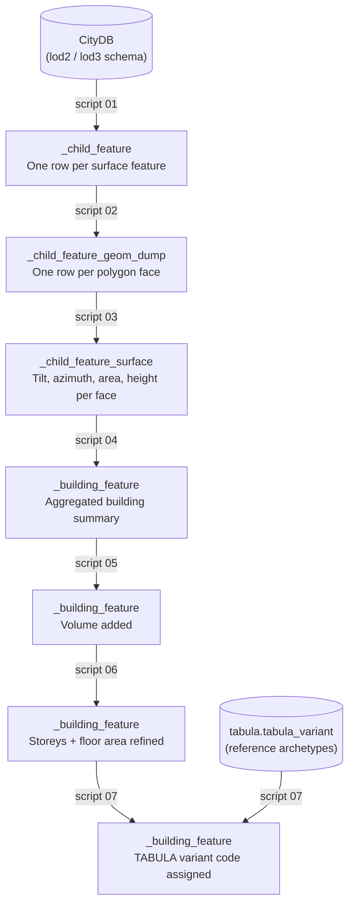

# SQL Extraction Pipeline

This section documents the seven SQL scripts that transform raw 3D building geometry from the CityDB database into a structured set of building features ready for TABULA classification.

The scripts run in order, numbered `01_` through `07_`. Each script reads from the output of the previous one, so the pipeline is strictly sequential within a batch of buildings.

---

## What it does

Given a batch of building IDs, the pipeline:

1. Finds all surface polygons that belong to each building (roof, wall, ground faces).
2. Flattens compound multi-polygon geometries into individual polygon faces.
3. Computes a surface normal for each face, then derives tilt, azimuth, area, and height.
4. Aggregates those per-surface values into a single summary row per building.
5. Approximates building volume from height × footprint area.
6. Refines the storey count and total floor area.
7. Matches each building to its closest TABULA archetype using nearest-neighbour search in feature space.

---

## Data flow

---

## Script reference

| Script | Purpose | Writes to |
|--------|---------|-----------|
| [01 — Get child features](01-get-child-features.md) | Spatially match surface features to each building solid | `_child_feature` |
| [02 — Dump geometry](02-dump-geometry.md) | Explode multi-polygon surfaces to individual polygon faces | `_child_feature_geom_dump` |
| [03 — Surface attributes](03-surface-attributes.md) | Compute surface normal, tilt, azimuth, area, and height per face | `_child_feature_surface` |
| [04 — Building features](04-building-features.md) | Aggregate surface attributes into one row per building | `_building_feature` |
| [05 — Volume](05-volume.md) | Approximate building volume from height × footprint | `_building_feature` (UPDATE) |
| [06 — Storeys](06-storeys.md) | Refine storey count; overwrite floor area as footprint × storeys | `_building_feature` (UPDATE) |
| [07 — TABULA labelling](07-tabula-labelling.md) | Nearest-neighbour match to closest TABULA archetype | `_building_feature` (UPDATE) |

---

## Key concepts

### LoD (Level of Detail)

CityGML defines several levels of geometric detail for buildings. City2TABULA works with **LoD2** (simple roof shapes, no interior) and **LoD3** (detailed facades). Each LoD is stored in its own database schema (`lod2` or `lod3`); the scripts use `{lod_schema}` as a placeholder that is substituted at runtime.

### Surface types

Each building solid is decomposed into typed surface features:

| CityGML type | Meaning |
|---|---|
| `RoofSurface` | The roof polygon(s) |
| `WallSurface` | Facade/wall polygon(s) |
| `GroundSurface` | The building footprint polygon(s) on the ground |

Scripts 03 and 04 treat these three types differently — for example, tilt and azimuth are computed differently for roofs versus walls, and the footprint area comes from `GroundSurface` only.

### Idempotency

Every INSERT script checks whether the building has already been processed and skips it if so. This means the pipeline is safe to re-run against a partially-processed batch without creating duplicate rows.

### SQL templating

Scripts contain `{placeholder}` tokens that are resolved before execution:

| Placeholder | Example value |
|---|---|
| `{lod_schema}` | `lod2` |
| `{lod_level}` | `2` |
| `{city2tabula_schema}` | `city2tabula` |
| `{building_ids}` | `(1, 2, 3, ...)` |
| `{srid}` | `25832` |
