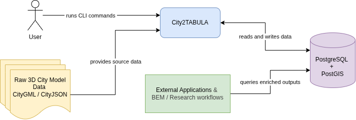

# City2TABULA Documentation

&nbsp;

&nbsp;

!!! note
    This project is under active development and may change frequently.

## Overview

City2TABULA is a Go-based CLI tool for processing raw 3D city model data and generating enriched building feature data in PostgreSQL/PostGIS. It supports the preparation of building datasets for downstream energy-modelling, research, and classification workflows.

The tool is designed for scalable processing of LoD2 and LoD3 building data stored through CityDB-based database structures. It automates key steps such as data setup, import, and feature extraction within a single pipeline.

<picture>
    <source type="image/svg+xml" srcset="assets/diagrams/architecture/system-context/system-context.svg">
    
</picture>

## Key Capabilities

- CLI-driven pipeline for 3D city model processing
- Support for CityGML and CityJSON input data
- PostgreSQL/PostGIS integration for persistent storage and analysis
- Feature extraction from LoD2 and LoD3 building data
- Scalable batch-based and parallel processing
- Outputs for downstream research and energy-modelling workflows

## Support

If you encounter a problem or would like to suggest an improvement, please open an issue in the project repository using relevant [Issue Template](https://github.com/THD-Spatial/city2tabula/issues/new/choose).
