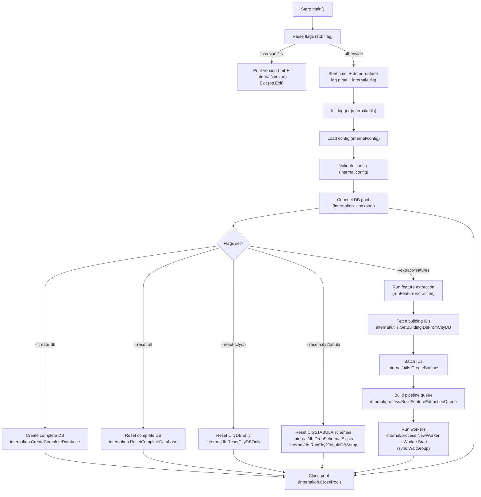

# City2TABULA Documentation

!!! note
    This project is under active development and will be updated regularly.

## About

City2TABULA is a high-performance Go-based tool for preparing training data for building classification using spatial data from 3D CityDB and PostGIS-enabled PostgreSQL databases. The tool is part of a larger pipeline to classify OSM buildings into TABULA building types for heating demand estimation.

The pipeline processes spatial features such as attached neighbours, grid-based geometry relationships, and building characteristics from LOD2 and LOD3 3D building data. The extracted data is then used to train Random Forest (RF) models for automated building classification.

## Key Features

### Core Processing Capabilities

- Building-Centric Parallel Processing: Advanced parallel architecture processing 100K+ buildings efficiently
- CityDB Integration: Native support for 3D building data (LOD2/LOD3) in CityGML and CityJSON format from CityDB schemas
- Parameterized SQL Templates: Dynamic SQL scripts supporting multiple LOD levels
- Batch Processing: Optimized batch processing with configurable batch sizes

### Data Processing Pipeline

- Multi-LOD Support: Process both LOD2 and LOD3 building data simultaneously
- Spatial Analysis: Building geometry analysis, volume calculations, and neighbour detection
- Feature Extraction: Child feature extraction (walls, roofs, windows) with geometric relationships
- TABULA Integration: Building type classification using TABULA methodology

### Performance & Scalability

- Memory Efficient: Batch-based processing preventing memory exhaustion
- Parallel Architecture: Goroutine-based workers achieving 2.5-4x performance improvements
- Database Optimization: Query plan caching and connection pooling

## Architecture Overview

The City2TABULA pipeline consists of several key components:

1. **3D CityDB Setup**: Automated creation of 3D CityDB schemas for LOD2/LOD3 data
2. **Data Import**: Import of building geometry data from GML files into CityDB
3. **Feature Extraction**: Parallel processing of building features using SQL-based analysis

## CLI Flags Workflow

The CLI entrypoint is `cmd/main.go`. The workflow below shows the common startup path and which internal packages/functions are touched by each flag.

!!! info
    Flags are independent and can be combined. If you pass multiple flags, the corresponding actions run sequentially in the order they appear in `main()`.

## Support

For issues and questions, please refer to the troubleshooting section or create an issue in the project repository.
