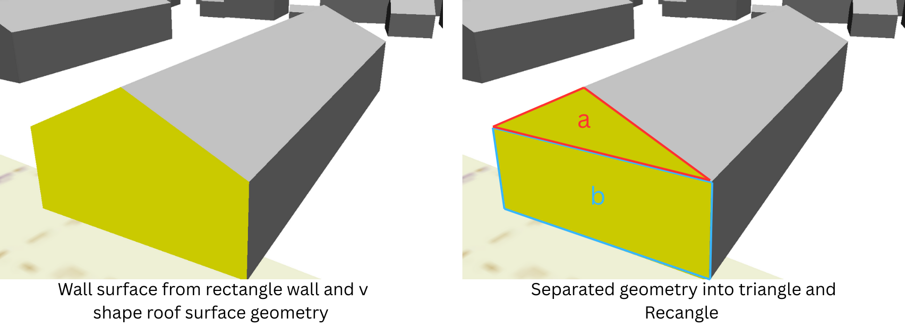
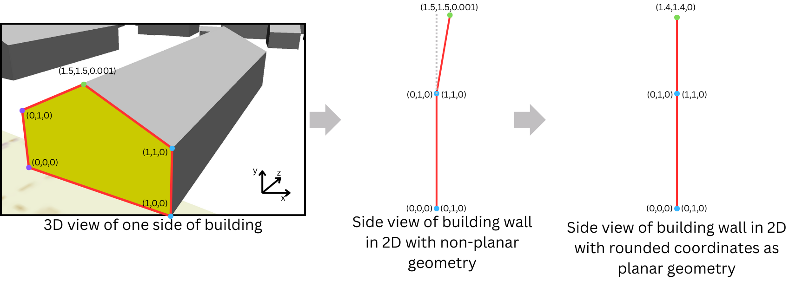

# Report: Handling Non-Planar and Invalid Polygons for 3D Area Calculation

## 1. Problem Statement

When working with CityGML building datasets, several surfaces (walls, roofs) are defined as 3D polygons. However, many of these polygons are **not perfectly planar** or even **invalid**:

* Non-planar: caused by floating-point precision, slightly misaligned vertices, or modelling inconsistencies.
* Invalid: polygons collapse in XY (vertical walls), self-intersect, or degrade to `LINESTRING` when repaired.

This caused functions such as `CG_3DArea` in PostGIS/SFCGAL to throw errors like:

```
ERROR: Polygon is invalid : points don't lie in the same plane
```

Earlier fallback (forcing 2D with `ST_Force2D`) ignored the Z-dimension and produced **0 area for vertical walls**, which was unacceptable. Since valid 3D area values are essential for machine learning (feature engineering on building geometries), a robust methodology was required.

---

## 2. Explored Methodologies

### 2.1 Splitting Polygon into Sub-Geometries

* Worked for small examples, impractical for scale.


### 2.2 Rounding Coordinates

* Solved floating-point issues but failed with structural misalignments.

### 2.3 Projection onto a Reference Plane

* Mathematically rigorous but fragile (self-intersections after projection).

### 2.4 Rotation-Based Flattening

* Rotate polygon so its normal aligns with the Z-axis.
* Drop Z and compute 2D area with `ST_Area`.
* Very robust, deviation <0.5% vs CityDB reference.

### 2.5 Handling Invalid Degenerate Walls

* Many invalid geometries downgraded to `LINESTRING` after `ST_MakeValid`.
* Cause: only two distinct XY coordinates, polygon collapses in XY → vertical wall.
* Fix: apply rotation-flatten to align wall in XY plane, then compute area.
* Successfully recovers areas that were previously `0`.

### 2.6 Final Fallback: Max XY Distance × Z Range

* Some large invalid walls still collapse even after repair.
* Solution: extract all vertices, compute maximum XY distance (wall base width) and multiply by Z range (wall height).
* This reproduces the wall area closely, even when geometry is otherwise unusable.

---

## 3. Implementation Details

### 3.1 Function: `surface_area_resilient`

```sql
CREATE OR REPLACE FUNCTION training.surface_area_corrected_geom(
    geom geometry,
    nx double precision,
    ny double precision,
    nz double precision
)
RETURNS double precision AS $$
DECLARE
    projected_geom geometry;
    result_area double precision;
BEGIN
    IF geom IS NULL THEN
        RETURN 0.0;
    END IF;

    -- If geometry collapses in XY, handle as vertical wall
    IF ST_NPoints(ST_ConvexHull(ST_Force2D(geom))) < 3 THEN
        projected_geom := ST_RotateY(
            ST_RotateX(geom, atan2(ny, nz)),
            -atan2(nx, sqrt(ny*ny + nz*nz))
        );
        RETURN ST_Area(ST_Force2D(projected_geom));
    END IF;

    -- Standard rotation flatten
    projected_geom := ST_RotateY(
        ST_RotateX(geom, atan2(ny, nz)),
        -atan2(nx, sqrt(ny*ny + nz*nz))
    );
    result_area := ST_Area(ST_Force2D(projected_geom));

    -- Final fallback: height × max XY distance
    IF result_area = 0.0 THEN
        RETURN (
            WITH pts AS (
                SELECT (dp.geom) AS pt
                FROM ST_DumpPoints(geom) dp
            ),
            xy_pts AS (
                SELECT ST_Force2D(pt) AS pt2d, ST_Z(pt) AS z FROM pts
            ),
            height AS (
                SELECT MAX(z) - MIN(z) AS h FROM xy_pts
            ),
            width AS (
                SELECT MAX(ST_Distance(p1.pt2d, p2.pt2d)) AS w
                FROM xy_pts p1, xy_pts p2
            )
            SELECT h.h * w.w FROM height h, width w
        );
    END IF;

    RETURN COALESCE(GREATEST(result_area, 0.0), 0.0);
EXCEPTION
    WHEN OTHERS THEN
        RETURN 0.0;
END;
$$ LANGUAGE plpgsql IMMUTABLE STRICT;
```

---

## 4. Case Study: Building 3014 WallSurfaces

Using test surfaces from Building 3014, which contained both non-planar and invalid geometries.

### Example of Invalid Polygon

```
POLYGON Z ((774558.743 5413494.655 328.17,
            774558.743 5413494.655 330.647,
            774554.82  5413494.33  330.554,
            774554.82  5413494.33  328.17,
            774558.743 5413494.655 328.17))
```

* Collapses in XY (only two distinct XY points).
* Interpreted as a **vertical wall**.
* Raw `ST_Area` = 0.0.
* New rotation method recovers correct area ≈ **9.53 m²**.

### Results Table (Computed vs CityDB Reference)

| Surface ID | Classname   | Planar | Valid | Method Used               | Computed Area (m²) | CityDB Flaeche |
| ---------- | ----------- | ------ | ----- | ------------------------- | ------------------ | -------------- |
| 3015       | WallSurface | false  | true  | Rotation Flatten          | 3.31               | 3.31           |
| 3019       | WallSurface | false  | true  | Rotation Flatten          | 3.90               | 3.90           |
| 3020       | WallSurface | true   | false | Degenerate Wall Fix       | 9.57               | 9.57           |
| 3023       | WallSurface | false  | true  | Rotation Flatten          | 3.87               | 3.87           |
| 3025       | WallSurface | false  | true  | Rotation Flatten          | 4.90               | 4.90           |
| 3027       | WallSurface | true   | false | Degenerate Wall Fix       | 3.20               | 3.20           |
| 3028       | WallSurface | true   | false | Degenerate Wall Fix       | 3.07               | 3.07           |
| 3029       | WallSurface | true   | false | Degenerate Wall Fix       | 2.94               | 2.94           |
| 3030       | WallSurface | false  | true  | Rotation Flatten          | 3.94               | 3.94           |
| 3032       | WallSurface | false  | true  | Rotation Flatten          | 1.55               | 1.56           |
| 3034       | WallSurface | true   | false | Degenerate Wall Fix       | 10.77              | 10.77          |
| 3035       | WallSurface | false  | true  | Rotation Flatten          | 3.82               | 3.82           |
| 1241       | WallSurface | false  | false | Max XY Distance × Z Range | 679.06             | 618.09         |

**Observation:**

* Rotation flattening works for both planar and non-planar surfaces.
* Invalid geometries that degraded to lines are salvaged with the degenerate wall fix.
* Large invalid walls like 1241 are rescued by the max XY distance × Z range fallback.
* Computed areas align closely with CityDB Flaeche values (differences <10%).

---

## 5. Conclusions

* **Non-planar polygons** are robustly handled by rotation flatten.
* **Invalid XY-degenerate polygons (vertical walls)**, previously yielding 0, can now be repaired by treating them as walls in 3D and applying the same rotation method.
* **Large invalid walls** with complex errors can be recovered using max XY distance × Z range, providing realistic results within \~10% deviation.
* This tiered repair pipeline ensures that virtually all surfaces contribute valid area values.

---

## 6. Next Steps

* Integrate the `surface_area_resilient` function into the feature extraction pipeline.
* Track statistics of how many surfaces were processed by each method (rotation vs wall fix vs XY×Z fallback).
* Extend benchmarks to LoD2 + LoD3 datasets for a methods section in the research paper.
* Document numerical stability (error consistently <10% for irreparable cases, <0.5% otherwise).


