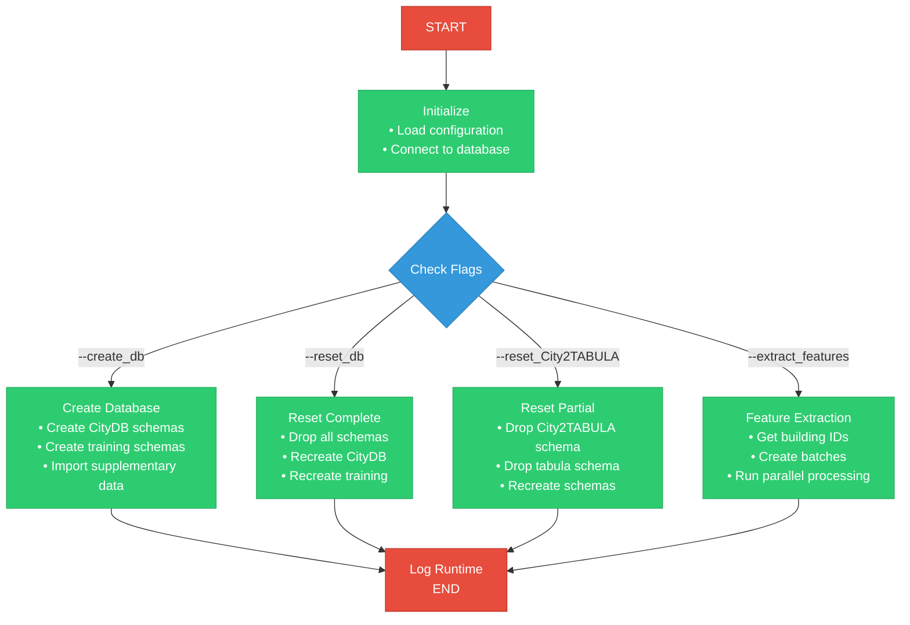
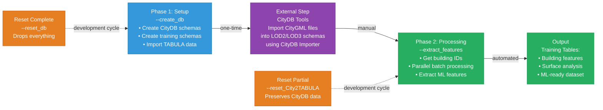
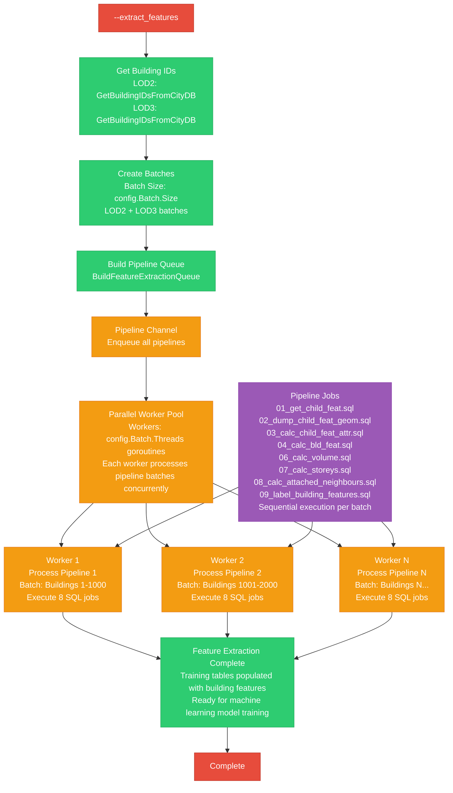
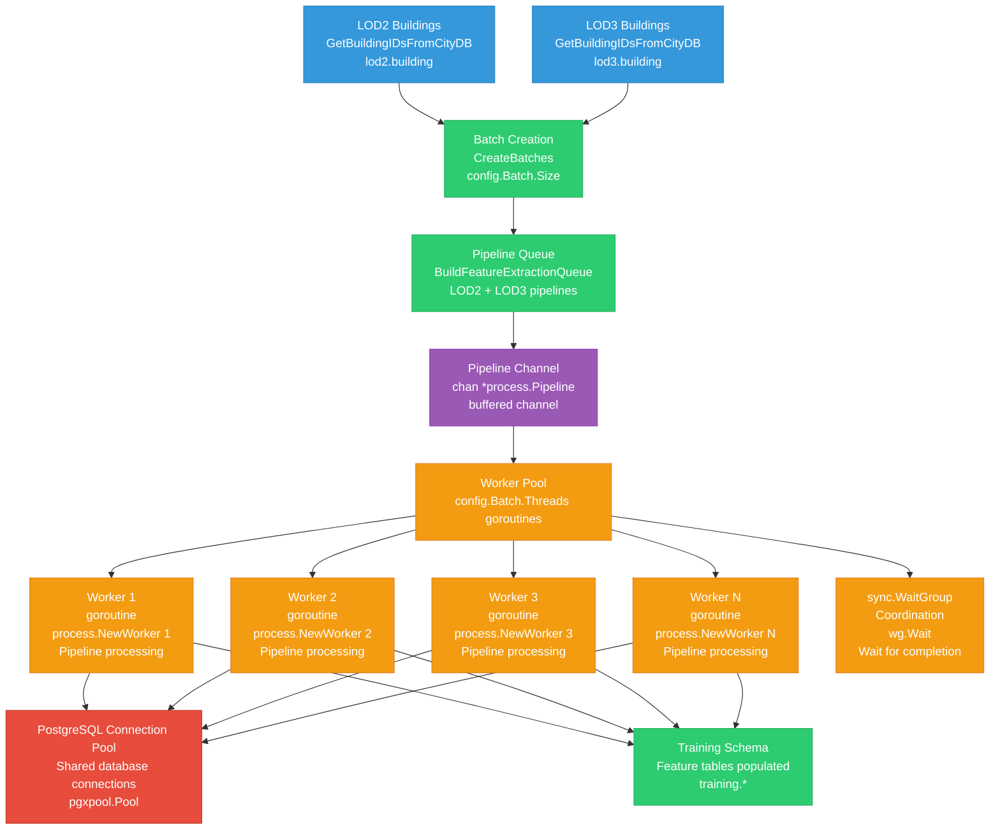
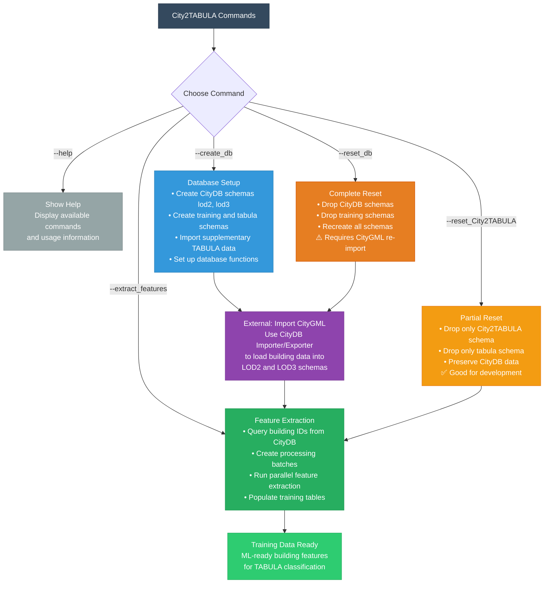

# City2TABULA Workflow Diagrams - Mermaid Code

## 1. Main Workflow Diagram

## 2. Complete Pipeline Workflow

## 3. Feature Extraction Pipeline

## 4. Parallel Processing Architecture

## 5. Command Usage Flowchart

## Usage Instructions

To use these Mermaid diagrams:

1. **In GitHub/GitLab**: Paste the code directly in markdown files - they'll render automatically
2. **In Documentation**: Use mermaid code blocks in your .md or .rst files
3. **Online Editor**: Use [Mermaid Live Editor](https://mermaid.live/) to preview and export
4. **VS Code**: Install the Mermaid Preview extension
5. **Export**: Generate SVG/PNG from the online editor for static documentation

## Benefits of Mermaid Diagrams

- **Version Controlled**: Diagrams as code in your repository
- **Easy Updates**: Text-based, easy to modify and maintain
- **Consistent Styling**: Automatic professional appearance
- **Collaborative**: Easy to review changes in pull requests
- **Multi-format**: Can export to SVG, PNG, PDF when needed